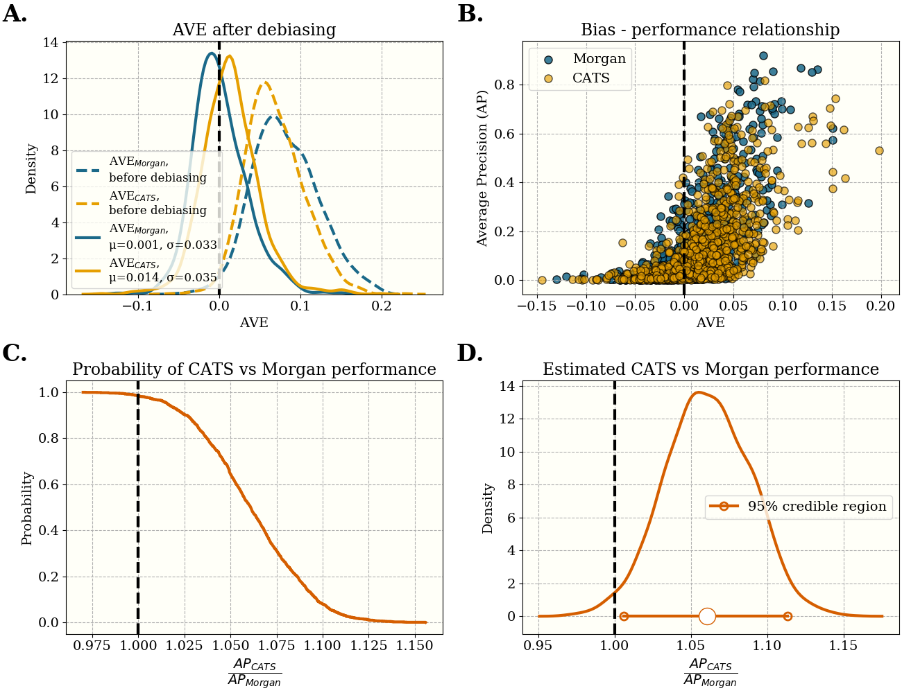

# fp_generalizability

Ligand based virtual screening uses machine learning for drug discovery. In 2018 Wallach et al. (1) demonstrated that the performance in many benchmarks was strongly correlated with bias in the train/test splits used for evaluation, and the authors of that work also proposed a genetic algorithm to reduce bias. Subsequently, using the genetic algorithm, it was shown by Sundar et al. (2) that the _de facto_ standard featurization (i.e. ECFP a.k.a. Morgan fingerprints) performs poorly when the bias is low. We extend both results - we present an algorithm for fast (~1-2s) unbiased train/test splitting, which allows us to sample hundreds of splits in an afternoon on a laptop, and we use this to compare the performance of two fingerprints (Morgan/ECFP and CATS). 

For the main result, see the figure below. 
- A) Debiasing by trimming nearest neighbors from the training set. The starting point for all fingerprints is single-linkage clustering of the Morgan fingerprints. The clusters are randomly sampled to get some test/train data. We then trim the nearest neighbors to the test data from the training data. Observe that AVE for both fingerprints reduces towards zero. 
- B) The by-now well known relationship between bias (as measured by AVE) and performance. In the manuscript we also show how you game the AVE score with the CATS fingerprint, producing low AVE without this relationship. So - be cautious when using CATS to debias!
- C) We then did a pairwise comparison between the performance of Morgan-debiased and (correctly) CATS-debiased fingerprints. Conveniently, we only alter the training data in any given evaluation. That means the identity of the test set is exactly the same, facilitating a pairwise comparison. This panel shows the probability that CATS fingerprint performs better. The probability that _relative_ performance is greater than 1 is over 99%. 
- D) But how big is the difference? We estimated the mean improvement with PyMC3. You can see that CATS has about 1.01 - 1.11 improvement, so up to a possible 10%. Of course this is an average over many splits and 100 targets, so for any given target the results might swing the other way! 

If you want to perform such an analysis yourself, we recommend first clustering in Morgan-space using the PARIS algorithm - see [sknetwork](https://scikit-network.readthedocs.io/en/latest/) for a super fast implementation that works on large datasets. After clustering, simply mask the "X" nearest neighbors from the training sets, where 'nearest' is measured with respect to the test set.  While this does result in data loss, it's increasingly believed that you don't need huge imbalance to get nice performance, see (3) and (4). 

Raise an issue in the tracker or drop a line to lewis dot martin at sydney edu au with any questions/issues. 

>(1) Wallach, Izhar, and Abraham Heifets. "Most ligand-based classification benchmarks reward memorization rather than generalization." Journal of chemical information and modeling 58.5 (2018): 916-932.
>
>(2) Sundar, Vikram, and Lucy Colwell. "The Effect of Debiasing Protein Ligand Binding Data on Generalisation." Journal of Chemical Information and Modeling (2019).
>
>(3) Caceres, Elena L., Nicholas C. Mew, and Michael J. Keiser. "Adding stochastic negative examples into machine learning improves molecular bioactivity prediction." BioRxiv (2020).
>
>(4) de León, Antonio de la Vega, Beining Chen, and Valerie J. Gillet. "Effect of missing data on multitask prediction methods." Journal of cheminformatics 10.1 (2018): 26.

